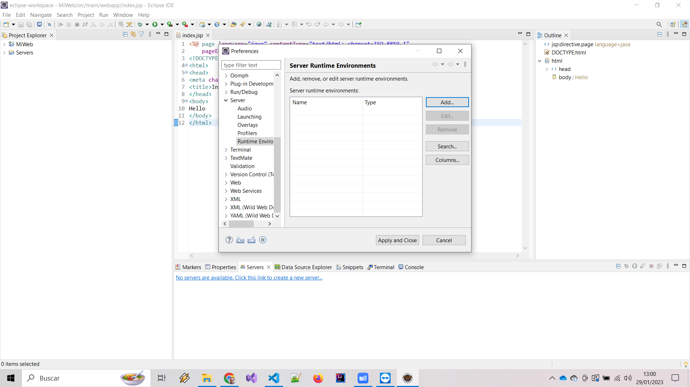
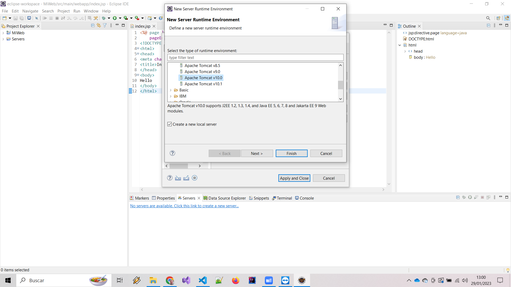
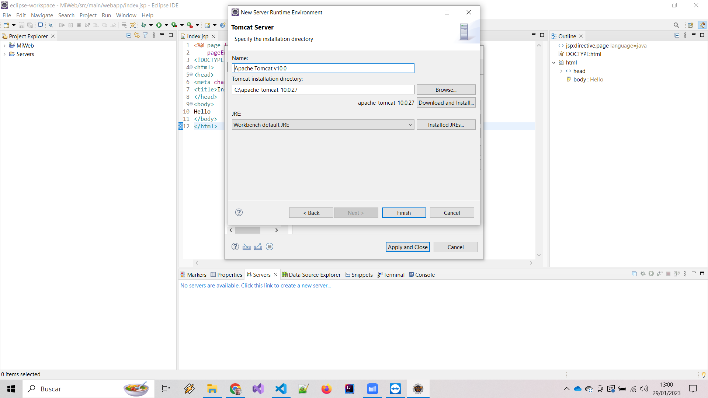
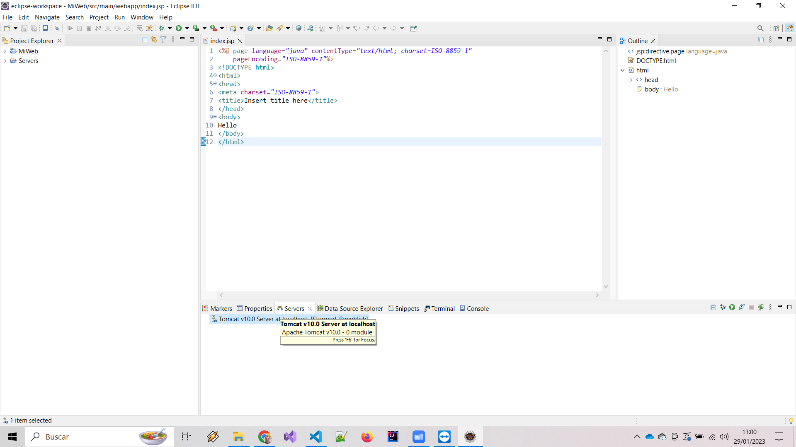

# Java Tomcat #

## Tomcat ##

Para instalar Apache Tomcat en Windows y enlazarlo con Eclipse, sigue estos pasos:

1.    Descarga la última versión de Apache Tomcat desde el sitio web oficial (https://tomcat.apache.org/download-10.cgi) y descomprime el archivo descargado en una carpeta en tu sistema.
Versión 10 para windows: https://dlcdn.apache.org/tomcat/tomcat-10/v10.1.7/bin/apache-tomcat-10.1.7-windows-x64.zip

1.    Abre Eclipse y ve a "Window" -> "Preferences" -> "Server" -> "Runtime Environments". Haz clic en el botón "Add" para agregar un nuevo servidor.

1.    Selecciona "Apache" -> "Apache Tomcat" y haz clic en "Next".

1.    En la ventana siguiente, selecciona la carpeta donde descomprimiste Tomcat en el paso 1 y haz clic en "Finish".

1.    Ahora deberías ver Apache Tomcat en la lista de servidores disponibles en Eclipse. Haz clic en "Apply" y luego en "OK" para guardar los cambios.

1.    Crea un nuevo proyecto web en Eclipse y agrega tu código servlet.

1.    Haz clic derecho en tu proyecto y selecciona "Run As" -> "Run on Server". Selecciona Apache Tomcat y haz clic en "Finish".

1.    Apache Tomcat debería iniciarse y tu aplicación servlet debería estar disponible en la URL http://localhost:8080/[nombre_de_tu_aplicacion].

Nota: Los pasos y las pantallas pueden variar dependiendo de la versión de Eclipse y Tomcat que estés utilizando.

