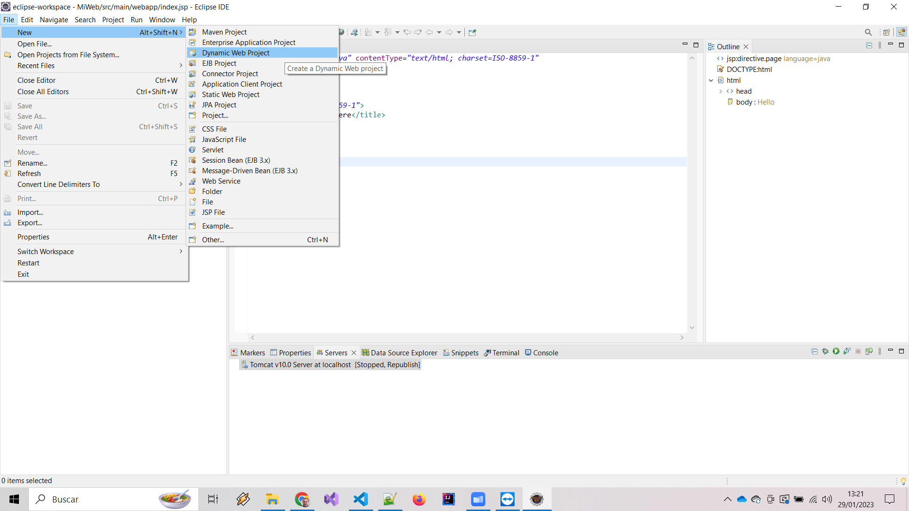
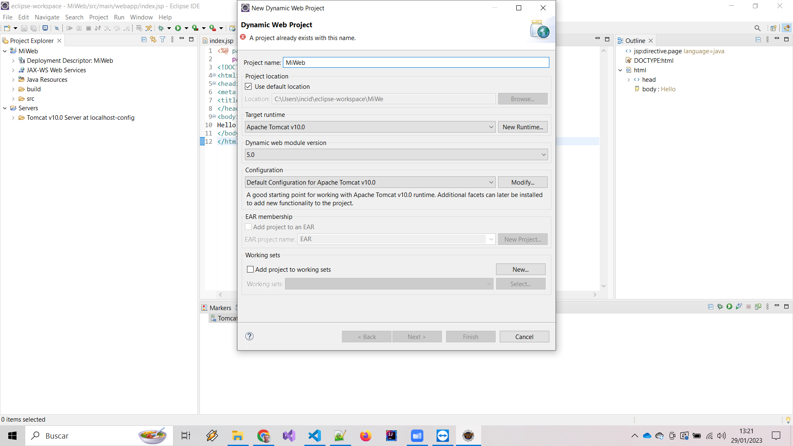
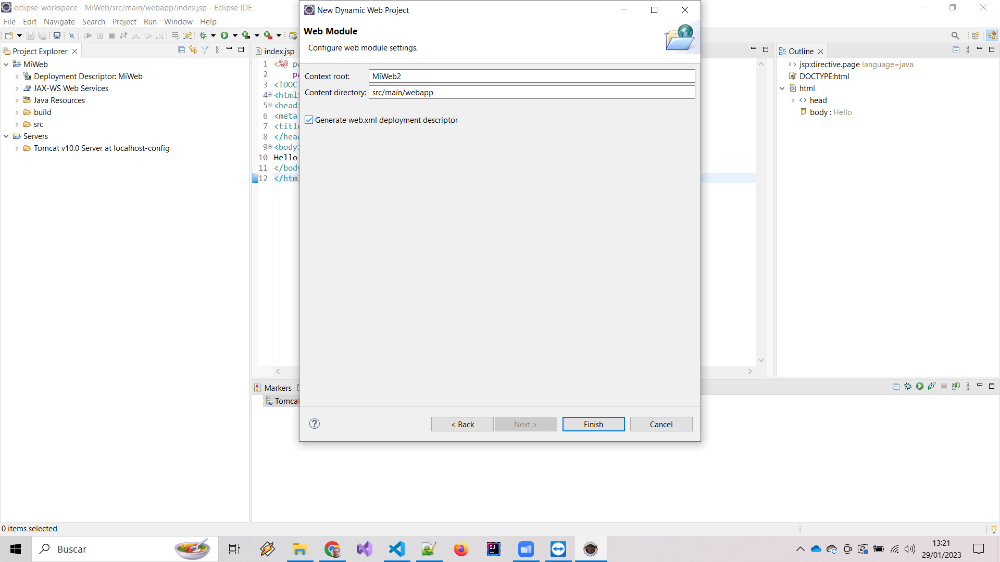

# Java Dynamic Web #

## Dynamic Web ##

Para crear una aplicación web dinámica con Java y Eclipse, sigue estos pasos:

Abre Eclipse y crea un nuevo proyecto web. Ve a "File" -> "New" -> "Dynamic Web Project" y sigue las instrucciones para configurar el proyecto.

Agrega las dependencias necesarias para tu proyecto. Por ejemplo, si estás utilizando una base de datos, asegúrate de agregar el controlador JDBC correspondiente a tu proyecto.

Crea una clase Servlet que extienda de HttpServlet. Esta clase será responsable de manejar las solicitudes HTTP de tu aplicación. Por ejemplo, puedes crear un servlet que maneje solicitudes GET y POST.

Sobrescribe los métodos doGet() y doPost() en tu clase Servlet para manejar las solicitudes GET y POST respectivamente. En estos métodos, puedes especificar la lógica de tu aplicación, como procesar formularios, recuperar datos de una base de datos, y generar respuestas.

Crea un archivo web.xml en el directorio WEB-INF para configurar tu aplicación web. En este archivo, debes especificar el nombre de tu Servlet y la URL a la que debe responder.

Agrega vistas JSP o HTML a tu proyecto para mostrar la interfaz de usuario de tu aplicación. Puedes utilizar etiquetas JSP para mostrar datos dinámicamente en tus vistas.

Haz clic derecho en tu proyecto y selecciona "Run As" -> "Run on Server" para iniciar tu aplicación web. Asegúrate de tener Apache Tomcat o otro servidor web configurado en Eclipse para ejecutar tu aplicación.

Accede a tu aplicación web en el navegador utilizando la URL http://localhost:8080/[nombre_de_tu_aplicacion].

Nota: Los pasos y las pantallas pueden variar dependiendo de la versión de Eclipse y el servidor web que estés utilizando.

